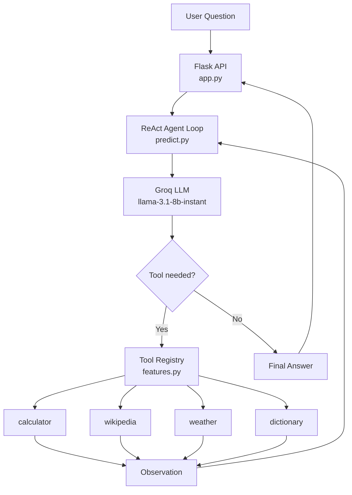

# Project 6 — Final Summary

## What You Built

A ReAct (Reasoning + Acting) agent called **Birdie** — a backyard bird watching assistant for the northeastern United States. The agent answers bird-related questions by reasoning about what information it needs, calling real tools to fetch it, and looping until it has a complete grounded answer.

---

## Architecture



---

## Project Structure

```
project6_react_agent/
├── config.py       # LLM settings, system prompt, tool definitions
├── dataset.py      # 10 test questions with expected tool usage
├── features.py     # Tool implementations + TOOL_REGISTRY
├── train.py        # Pipeline validation + smoke tests
├── evaluate.py     # Agent vs baseline benchmark
├── predict.py      # ReAct loop — the heart of the project
├── app.py          # Flask API on port 5003
└── docs/
    ├── project_intro.md
    ├── concept_reference.md
    └── project_summary.md
```

---

## Evaluation Results

| Question | Tool Used | Answer Quality | Iterations |
|---|---|---|---|
| American Robin family and scientific name | wikipedia | ✅ Correct | 2 |
| What does altricial mean | dictionary | ❌ Hit MAX_ITERATIONS | 6 |
| Cardinal vs Jay weight percentage | calculator | ✅ 88.89% correct | 2 |
| Hartford CT weather for birding | weather | ✅ Live data, correct | 2 |
| Dark-eyed Junco order and range | wikipedia | ✅ Correct | 3 |
| What does irruption mean | dictionary | ❌ Hit MAX_ITERATIONS | 6 |
| Bird feeder math | calculator | ✅ 560 days correct | 2 |
| Cedar Waxwing family | wikipedia | ✅ Correct | 2 |
| Passerine vs raptor | dictionary | ✅ Correct | 4 |
| Philadelphia PA weather for birding | weather | ✅ Live data, correct | 2 |

**Tool usage accuracy: 10/10 (100%)**
**Answer accuracy: 8/10 (80%)**
**Average iterations: 3.1**

---

## Honest Limitations

**2 dictionary questions hit MAX_ITERATIONS** — `llama-3.1-8b-instant` is an 8 billion parameter model. It follows simple instructions reliably but sometimes fails to commit to a Final Answer after receiving a clear tool result, instead looping through additional unnecessary tool calls. This is a model size limitation, not a code bug. A larger model (70b+) would resolve these failures with identical code.

**Free tier TPM constraints** — Groq's free tier limits to 6000 tokens per minute. Running 10 questions back to back with up to 6 iterations each pushes against this limit. Observations are truncated to 1000 characters to manage token consumption.

---

## What You Learned

- The ReAct pattern — interleaving reasoning and acting in a loop
- The difference between an LLM and an agent — the LLM is the brain, the agent is the system built around it
- Tool use — giving an LLM callable functions and letting it decide when to use them
- The tool registry — bridging LLM text output to real Python function calls
- Message history — how context accumulates across iterations and why token budgets matter
- Prompt engineering — iteratively refining instructions based on observed failure patterns
- API rate limits — TPM constraints and how to manage token consumption
- Grounded answers vs hallucination — the concrete difference tools make

---

## Stack

| Component | Technology |
|---|---|
| LLM | Groq API — llama-3.1-8b-instant |
| Agent framework | Custom ReAct loop in Python |
| Weather data | Open-Meteo API |
| Geocoding | Nominatim (OpenStreetMap) |
| Encyclopedia | Wikipedia MediaWiki API |
| Web API | Flask on port 5003 |
| Language | Python 3.12.9 |